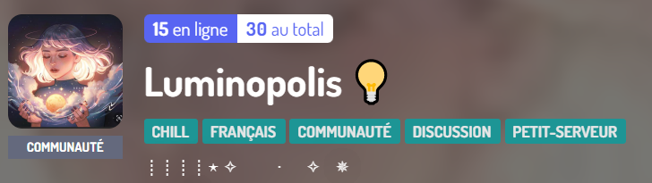

##

Luminopolis est un petit serveur communautaire où règne la bonne humeur.  
Le serveur existe depuis janvier 2020. Je suis l'heureuse fondatrice depuis juin 2021.  

## _Caractéristiques du bot_

Le principe du bot ***Twinkle Twinkle*** est de proposer des challenges. Une liste de question est prédéfinie pour ne plus à avoir y penser chaque semaine.  
L'intérêt est donc de gagner du temps pour que la fondatrice puisse faire d'autres choses.

## _Les différentes commandes_

> ***!challengeRestants*** pour obtenir le nombre de questions restantes disponibles

> ***!regles*** pour afficher les règles relatives au défi proposé

> ***!challengeNumero n*** pour obtenir une question bien précise où n désigne un chiffre compris entre 0 et 11

> ***!challengeAleatoire*** pour obtenir une question aléatoire dans la liste disponible
